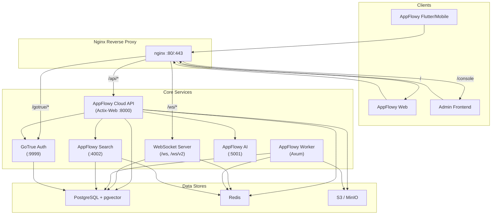
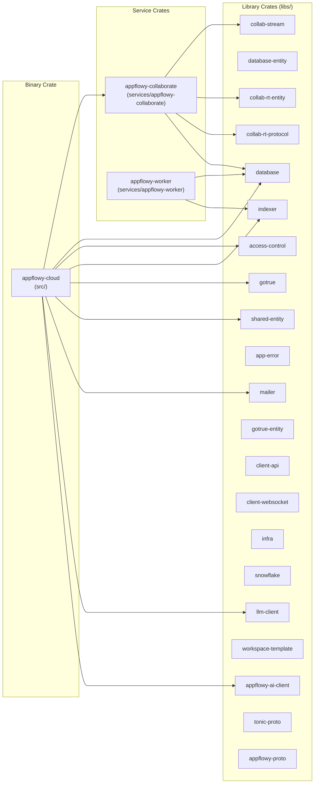
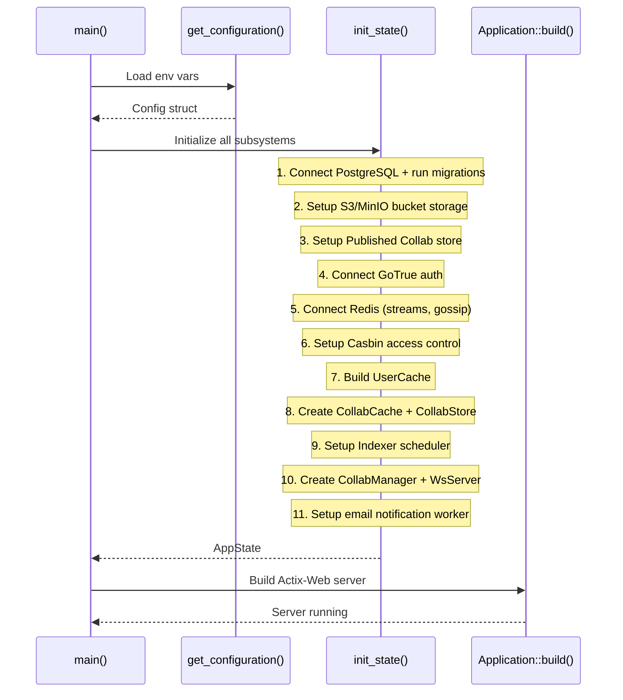
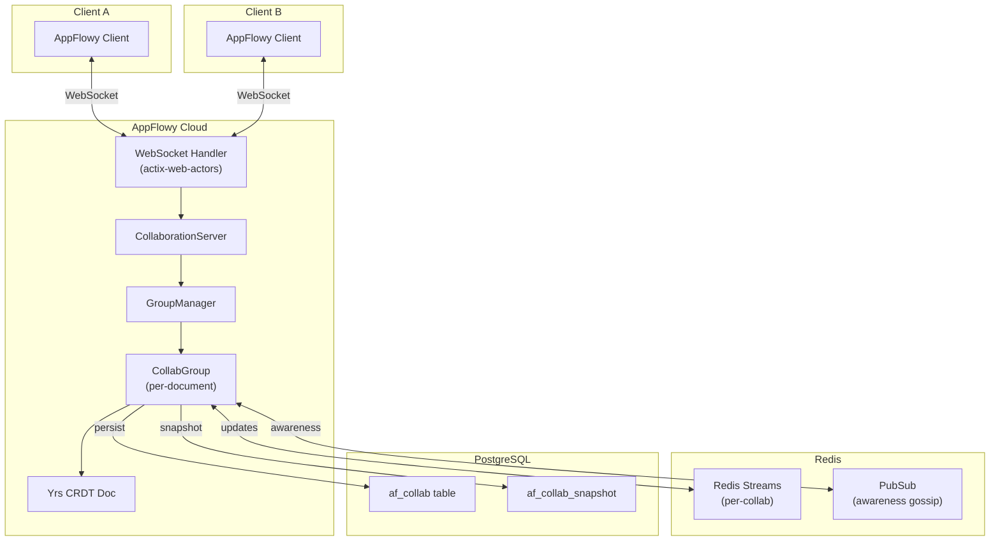
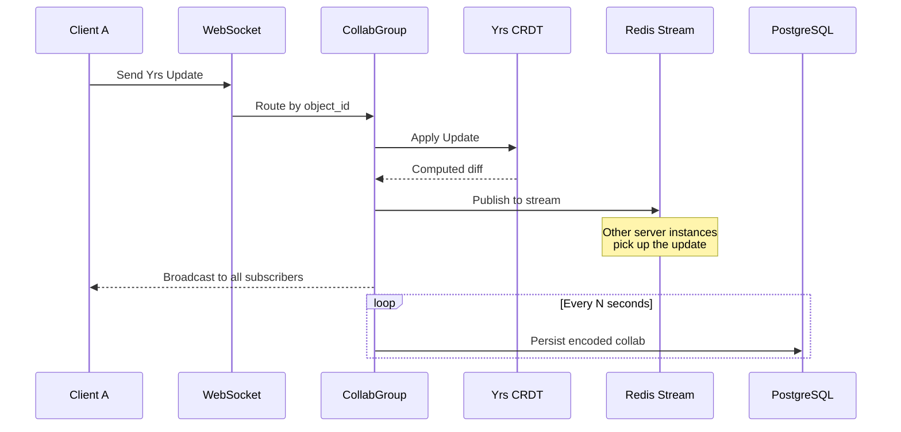
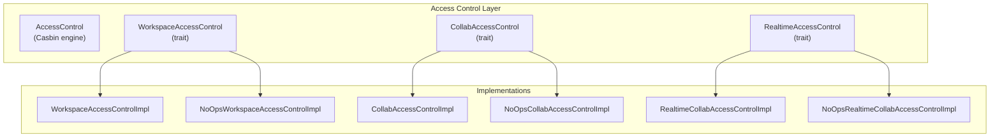
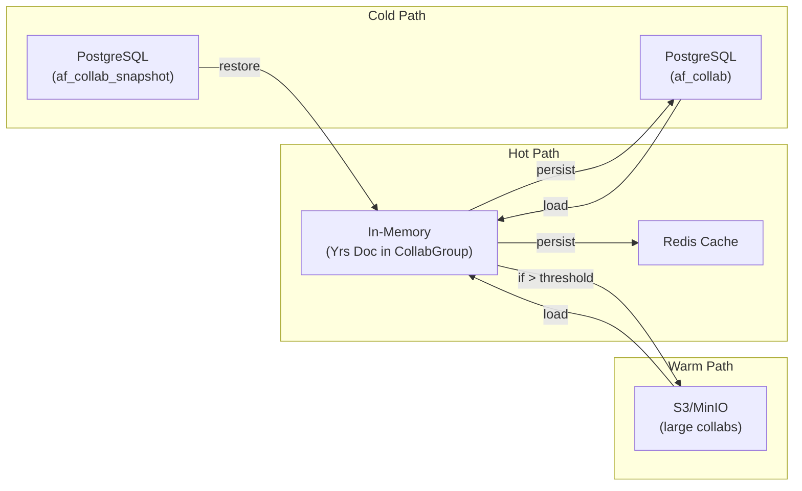
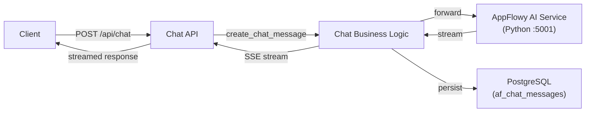
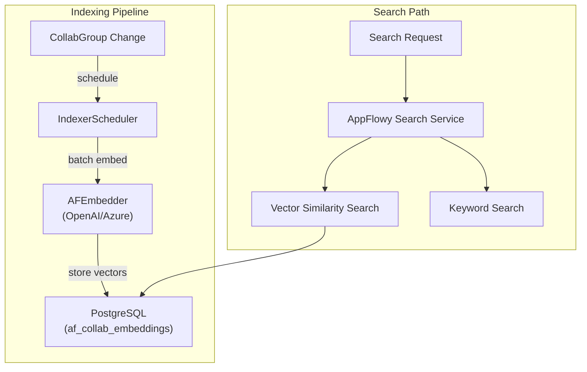

# AppFlowy Cloud — Architecture & Design Document

> **Codebase**: [AppFlowy-Cloud](file:///home/bajablast69/dev/AppFlowy-Cloud) · **Language**: Rust 🦀 · **License**: AGPL-3.0 (open core)

---

## 1. Executive Summary

AppFlowy Cloud is the server-side backend for the [AppFlowy](https://www.appflowy.com) productivity suite — an open-source alternative to Notion. It provides **real-time collaboration**, **authentication**, **file storage**, **AI-powered chat & search**, and **workspace management** for AppFlowy's desktop, mobile, and web clients.

The backend is written entirely in **Rust** and is designed as a modular monolith deployed via Docker Compose. It uses **Actix-Web** for its HTTP/REST API, **WebSockets** (via Actix actors) for real-time collaboration, **PostgreSQL** (with pgvector) as its primary data store, **Redis** for streaming / session management / caching, **S3/MinIO** for blob storage, and **GoTrue** (Supabase fork) for authentication.

---

## 2. High-Level Architecture

### Deployment Model

All services are orchestrated via a single [docker-compose.yml](file:///home/bajablast69/dev/AppFlowy-Cloud/docker-compose.yml) file containing **10 services**:

| Service | Image | Role |
|---|---|---|
| `nginx` | `nginx` | Reverse proxy, TLS termination, WebSocket upgrade |
| `postgres` | `pgvector/pgvector:pg16` | Primary database with vector extension |
| `redis` | `redis` | Streams, sessions, access-control cache |
| `minio` | `minio/minio` | S3-compatible blob storage |
| `gotrue` | `appflowyinc/gotrue` | Authentication (Supabase GoTrue fork) |
| `appflowy_cloud` | `appflowyinc/appflowy_cloud` | Main API server + real-time collab |
| `appflowy_worker` | `appflowyinc/appflowy_worker` | Background jobs (import, indexing) |
| `appflowy_search` | `appflowyinc/appflowy_search` | Semantic / keyword search service |
| `ai` | `appflowyinc/appflowy_ai` | AI chat, completions (Python) |
| `admin_frontend` | `appflowyinc/admin_frontend` | Admin web UI |
| `appflowy_web` | `appflowyinc/appflowy_web` | End-user web application |

---

## 3. Rust Workspace Structure

The project is organized as a **Cargo workspace** with a clear separation between the main application, services, and libraries.

### Key Crate Descriptions

| Crate | Path | Purpose |
|---|---|---|
| **appflowy-cloud** | [src/](file:///home/bajablast69/dev/AppFlowy-Cloud/src) | Main binary — HTTP API, WebSocket endpoints, business logic |
| **appflowy-collaborate** | [services/appflowy-collaborate](file:///home/bajablast69/dev/AppFlowy-Cloud/services/appflowy-collaborate) | Real-time collaboration engine — groups, CRDT sync, presence |
| **appflowy-worker** | [services/appflowy-worker](file:///home/bajablast69/dev/AppFlowy-Cloud/services/appflowy-worker) | Background worker — data import, background indexing |
| **database** | [libs/database](file:///home/bajablast69/dev/AppFlowy-Cloud/libs/database) | PostgreSQL operations — collab, workspace, user, publishing, search |
| **database-entity** | [libs/database-entity](file:///home/bajablast69/dev/AppFlowy-Cloud/libs/database-entity) | Shared DTOs for database operations |
| **access-control** | [libs/access-control](file:///home/bajablast69/dev/AppFlowy-Cloud/libs/access-control) | RBAC via Casbin — workspace, collab, realtime access control |
| **indexer** | [libs/indexer](file:///home/bajablast69/dev/AppFlowy-Cloud/libs/indexer) | Document embedding / vector indexing scheduler |
| **collab-stream** | [libs/collab-stream](file:///home/bajablast69/dev/AppFlowy-Cloud/libs/collab-stream) | Redis Streams abstraction — stream router, awareness gossip |
| **collab-rt-entity** | [libs/collab-rt-entity](file:///home/bajablast69/dev/AppFlowy-Cloud/libs/collab-rt-entity) | Realtime protocol message types |
| **collab-rt-protocol** | [libs/collab-rt-protocol](file:///home/bajablast69/dev/AppFlowy-Cloud/libs/collab-rt-protocol) | Yrs CRDT sync protocol implementation |
| **shared-entity** | [libs/shared-entity](file:///home/bajablast69/dev/AppFlowy-Cloud/libs/shared-entity) | Shared request/response DTOs between client and server |
| **client-api** | [libs/client-api](file:///home/bajablast69/dev/AppFlowy-Cloud/libs/client-api) | Rust client SDK for interacting with the cloud API |
| **gotrue / gotrue-entity** | [libs/gotrue](file:///home/bajablast69/dev/AppFlowy-Cloud/libs/gotrue) | GoTrue HTTP client + JWT entity types |
| **snowflake** | [libs/snowflake](file:///home/bajablast69/dev/AppFlowy-Cloud/libs/snowflake) | Distributed unique ID generator (Snowflake algorithm) |
| **mailer** | [libs/mailer](file:///home/bajablast69/dev/AppFlowy-Cloud/libs/mailer) | SMTP email sending abstraction |
| **llm-client** | [libs/llm-client](file:///home/bajablast69/dev/AppFlowy-Cloud/libs/llm-client) | LLM integration (OpenAI / Azure OpenAI) |
| **infra** | [libs/infra](file:///home/bajablast69/dev/AppFlowy-Cloud/libs/infra) | Utility functions (env vars, thread pool) |

---

## 4. Application Bootstrap & State

### Initialization Flow

The application entry point is [src/main.rs](file:///home/bajablast69/dev/AppFlowy-Cloud/src/main.rs). The full initialization is orchestrated by [init_state()](file:///home/bajablast69/dev/AppFlowy-Cloud/src/application.rs#L186-L397) in `application.rs`:

### AppState — The Central State Object

The [AppState](file:///home/bajablast69/dev/AppFlowy-Cloud/src/state.rs#L40-L64) struct holds all shared state across the application:

| Field | Type | Purpose |
|---|---|---|
| `pg_pool` | `PgPool` | PostgreSQL connection pool |
| `config` | `Arc<Config>` | Application configuration |
| `user_cache` | `UserCache` | UUID→UID mapping cache (DashMap) |
| `id_gen` | `Arc<RwLock<Snowflake>>` | Distributed ID generator |
| `gotrue_client` | `gotrue::api::Client` | GoTrue HTTP client |
| `redis_stream_router` | `Arc<StreamRouter>` | Redis stream pub/sub router |
| `awareness_gossip` | `Arc<AwarenessGossip>` | Redis-based awareness/presence |
| `redis_connection_manager` | `ConnectionManager` | Redis connection pool |
| `collab_cache` | `Arc<CollabCache>` | Redis + S3 + DB collab cache |
| `collab_storage` | `Arc<dyn CollabStore>` | Access-controlled collab store |
| `collab_access_control` | `Arc<dyn CollabAccessControl>` | Per-collab RBAC |
| `workspace_access_control` | `Arc<dyn WorkspaceAccessControl>` | Per-workspace RBAC |
| `realtime_access_control` | `Arc<dyn RealtimeAccessControl>` | Realtime connection RBAC |
| `bucket_storage` | `Arc<S3BucketStorage>` | S3 file storage |
| `published_collab_store` | `Arc<dyn PublishedCollabStore>` | Published pages storage |
| `pg_listeners` | `Arc<PgListeners>` | Postgres LISTEN/NOTIFY |
| `metrics` | `AppMetrics` | Prometheus metrics registry |
| `gotrue_admin` | `GoTrueAdmin` | Admin JWT token generator |
| `mailer` | `AFCloudMailer` | SMTP email sender |
| `ai_client` | `AppFlowyAIClient` | AI service HTTP client |
| `indexer_scheduler` | `Arc<IndexerScheduler>` | Background embedding scheduler |
| `ws_server` | `Addr<WsServer>` | WebSocket server actor address |

### Configuration

Configuration is loaded entirely from **environment variables** via [get_configuration()](file:///home/bajablast69/dev/AppFlowy-Cloud/src/config/config.rs#L178-L294). Key config sections:

- `DatabaseSetting` — PostgreSQL connection (URL, SSL, max connections)
- `GoTrueSetting` — GoTrue URL, JWT secret, service role
- `S3Setting` — S3/MinIO credentials, bucket, region
- `AppFlowyAISetting` — AI service host/port
- `CollabSetting` — Group persistence intervals, S3 threshold
- `AccessControlSetting` — Enable/disable workspace/collab/realtime ACL
- `NotificationSetting` — Email notification intervals
- `WebsocketSetting` — Heartbeat interval, client timeout, min version

---

## 5. API Layer

### HTTP Routing

The Actix-Web server is configured in [run_actix_server()](file:///home/bajablast69/dev/AppFlowy-Cloud/src/application.rs#L106-L184) with the following **scopes** (each defined in [src/api/](file:///home/bajablast69/dev/AppFlowy-Cloud/src/api)):

| Scope | File | Key Endpoints |
|---|---|---|
| `/api/workspace` | [workspace.rs](file:///home/bajablast69/dev/AppFlowy-Cloud/src/api/workspace.rs) | CRUD workspaces, members, invitations, collabs, pages, spaces, publishing, comments, reactions, quick notes, sharing |
| `/api/user` | [user.rs](file:///home/bajablast69/dev/AppFlowy-Cloud/src/api/user.rs) | User profile, workspace listing |
| `/ws` | [ws.rs](file:///home/bajablast69/dev/AppFlowy-Cloud/src/api/ws.rs) | WebSocket connections (v1 legacy, v2 new) |
| `/api/chat` | [chat.rs](file:///home/bajablast69/dev/AppFlowy-Cloud/src/api/chat.rs) | AI chat — create/delete chat, send questions, stream answers |
| `/api/file_storage` | [file_storage.rs](file:///home/bajablast69/dev/AppFlowy-Cloud/src/api/file_storage.rs) | File upload/download to S3 |
| `/api/search` | [search.rs](file:///home/bajablast69/dev/AppFlowy-Cloud/src/api/search.rs) | Semantic document search, search result summarization |
| `/api/template` | [template.rs](file:///home/bajablast69/dev/AppFlowy-Cloud/src/api/template.rs) | Template categories, creators, templates |
| `/api/import` | [data_import.rs](file:///home/bajablast69/dev/AppFlowy-Cloud/src/api/data_import.rs) | Notion/external data import |
| `/api/access-request` | [access_request.rs](file:///home/bajablast69/dev/AppFlowy-Cloud/src/api/access_request.rs) | Workspace access requests |
| `/ai` | [ai.rs](file:///home/bajablast69/dev/AppFlowy-Cloud/src/api/ai.rs) | AI completions |
| `/api/metrics` | [metrics.rs](file:///home/bajablast69/dev/AppFlowy-Cloud/src/api/metrics.rs) | Prometheus metrics endpoint |
| `/api/server-info` | [server_info.rs](file:///home/bajablast69/dev/AppFlowy-Cloud/src/api/server_info.rs) | Server version/info |
| `/api/invite-code` | [invite_code.rs](file:///home/bajablast69/dev/AppFlowy-Cloud/src/api/invite_code.rs) | Join workspace by invite code |
| `/health` | (inline) | Health check |

### Middleware Stack

Middleware is applied in reverse registration order:

1. **RequestIdMiddleware** — Generates unique request IDs for tracing
2. **SessionMiddleware** — Redis-backed session storage
3. **IdentityMiddleware** — Actix identity management
4. **MetricsMiddleware** — Request count/latency metrics
5. **NormalizePath** — Trims trailing slashes
6. *(Optional)* **CORS** — Enabled via `use_actix_cors` feature flag

### Business Logic Layer

Business logic lives in [src/biz/](file:///home/bajablast69/dev/AppFlowy-Cloud/src/biz) with the following modules:

| Module | Purpose |
|---|---|
| `authentication/` | JWT validation, user UUID extraction |
| `workspace/` | Workspace CRUD, member management, page views, publishing, sharing |
| `collab/` | Collab CRUD, database operations |
| `chat/` | AI chat operations, metrics |
| `search/` | Document search queries |
| `notification/` | Email notification worker |
| `data_import/` | Import processing |
| `template/` | Template management |
| `user/` | User profile operations |
| `pg_listener.rs` | PostgreSQL LISTEN/NOTIFY for realtime events |

---

## 6. Real-Time Collaboration System

The real-time collaboration engine is one of the most complex subsystems. It enables multiple users to edit documents, databases, and other collabs simultaneously using **Yrs** (Rust CRDT library, port of Yjs).

### Architecture Overview

### Key Components

#### CollaborationServer ([rt_server.rs](file:///home/bajablast69/dev/AppFlowy-Cloud/services/appflowy-collaborate/src/rt_server.rs))

The central coordinator for all real-time collaboration:

- **`handle_new_connection()`** — Registers new WebSocket connections, replaces stale connections
- **`handle_disconnect()`** — Removes users from collab groups
- **`handle_client_message()`** — Routes incoming CRDT updates to the correct group
- **`handle_client_http_update()`** — Handles collab updates received over HTTP (from web clients)
- **`create_group_if_not_exist()`** — Lazy-creates collaboration groups when first user joins

#### CollabGroup ([group_init.rs](file:///home/bajablast69/dev/AppFlowy-Cloud/services/appflowy-collaborate/src/group/group_init.rs))

Each `CollabGroup` manages a **single collaborative document** (Yrs CRDT instance):

- Maintains a **Yrs `Collab`** object in memory
- **Subscribes** users and broadcasts updates to all subscribers
- Runs **background tasks**:
  - **Inbound task**: Receives updates from Redis Streams (cross-instance sync)
  - **Awareness task**: Receives cursor/selection updates via Redis PubSub
  - **Snapshot task**: Periodically persists the CRDT document to PostgreSQL
- **Auto-prunes** — Inactive groups (no subscribers) are cleaned up after a grace period

#### WebSocket Protocol

Two WebSocket versions are supported:

| Version | Path | Description |
|---|---|---|
| **v1 (Legacy)** | `/ws/{token}/{device_id}` | Actix actor-based, single connection per device |
| **v2 (Current)** | `/ws/v2/{workspace_id}` | New architecture using `WsServer` actor and `CollabManager` |

Both require JWT authentication and enforce a **minimum client version**.

#### Data Flow: Collaborative Edit

---

## 7. Authentication & Authorization

### Authentication (GoTrue)

AppFlowy Cloud delegates authentication to **[GoTrue](https://github.com/supabase/auth)** (Supabase's auth server):

- **Email/Password** sign-up with configurable auto-confirm
- **OAuth providers**: Google, GitHub, Discord, Apple
- **SAML 2.0** support
- **Magic link** email authentication
- **JWT tokens** — All API requests are authenticated via JWT in the `Authorization` header

The [gotrue](file:///home/bajablast69/dev/AppFlowy-Cloud/libs/gotrue) library provides a Rust HTTP client for the GoTrue API.

### Authorization (Casbin RBAC)

Role-based access control is implemented using **[Casbin](https://casbin.org/)** via the [access-control](file:///home/bajablast69/dev/AppFlowy-Cloud/libs/access-control) crate:

Three granularity levels of access control enforce permissions:

| Level | Trait | Enforces |
|---|---|---|
| **Workspace** | `WorkspaceAccessControl` | Can user read/write/manage this workspace? |
| **Collab** | `CollabAccessControl` | Can user read/write this specific collab object? |
| **Realtime** | `RealtimeAccessControl` | Can user join the real-time session for this collab? |

Each level can be **independently enabled/disabled** via configuration flags. When disabled, the corresponding `NoOps` implementation allows all access (useful for development).

Access control policies can optionally be **cached in Redis** for performance (`APPFLOWY_ACCESS_CONTROL_REDIS_CACHE_ENABLED`).

---

## 8. Data Storage

### PostgreSQL Schema

The database uses **64 migration files** in [migrations/](file:///home/bajablast69/dev/AppFlowy-Cloud/migrations). Core tables include:

| Table | Purpose | Key Columns |
|---|---|---|
| `af_user` | User accounts | uid, uuid, email |
| `af_workspace` | Workspaces | workspace_id, owner_uid, workspace_name |
| `af_workspace_member` | Workspace membership | workspace_id, uid, role |
| `af_collab` | Collaborative objects | oid, blob, partition_key, workspace_id |
| `af_collab_snapshot` | Point-in-time snapshots | oid, blob, created_at |
| `af_collab_member` | Collab-level permissions | oid, uid, role_id |
| `af_collab_statistics` | Collab usage stats | oid, edit_count |
| `af_workspace_invitation` | Pending invitations | workspace_id, invitee_email, role, status |
| `af_user_profile_view` | User profile data | uid, name, email |
| `af_published_collab` | Published/shared pages | workspace_id, view_id, publish_name, blob |
| `af_chat_messages` | AI chat history | chat_id, message_id, content, role |
| `af_collab_embeddings` | Vector embeddings | fragment_id, oid, content_type, embedding |
| `af_template_category` | Template categories | category_id, name |
| `af_template` | Templates | template_id, category_id, name |
| `af_import_task` | Import jobs | task_id, status, workspace_id |

> [!NOTE]
> The `af_collab` table was **departitioned** in migration `20250318120849` — previously it used range partitioning, now it's a single flat table for simpler operations.

### Collab Storage Architecture

Collaborative objects use a **multi-tier storage** strategy:

- **CollabCache** ([collab/cache.rs](file:///home/bajablast69/dev/AppFlowy-Cloud/services/appflowy-collaborate/src/collab)) — Multi-level read-through cache (Redis → S3 → PostgreSQL)
- **S3 threshold** — Collabs larger than `APPFLOWY_COLLAB_S3_THRESHOLD` bytes (default 8KB) are stored in S3 instead of PostgreSQL
- **Published collabs** — Support two backends: PostgreSQL-only or S3 with PostgreSQL fallback

### File Storage (S3/MinIO)

File storage is handled by the [database/file](file:///home/bajablast69/dev/AppFlowy-Cloud/libs/database/src/file) module:

- **AwsS3BucketClientImpl** — S3 client wrapper supporting both AWS S3 and MinIO
- **S3BucketStorage** — Higher-level file operations with PostgreSQL metadata tracking
- **Presigned URLs** — For direct client-to-S3 uploads/downloads
- Files tracked in `af_blob_metadata` table with file status and source tracking

---

## 9. AI & Search Subsystem

### AI Chat

The AI chat system enables conversational AI within workspaces:

Key features:
- **Streaming responses** — Server-Sent Events (SSE) for real-time AI answers (v1, v2, v3 endpoint variants)
- **Chat context** — Documents can be added as context for AI conversations
- **Related questions** — AI generates follow-up question suggestions
- **Multiple AI models** — Configurable via `DEFAULT_AI_MODEL` and `DEFAULT_AI_COMPLETION_MODEL`

### Search & Indexing

The search system uses **vector embeddings** for semantic search:

#### IndexerScheduler ([libs/indexer/src/scheduler.rs](file:///home/bajablast69/dev/AppFlowy-Cloud/libs/indexer/src/scheduler.rs))

- Manages a **background embedding loop** with configurable buffer size
- Uses **OpenAI or Azure OpenAI** embeddings
- Supports both **immediate** and **background** embedding
- Writes embedding records to PostgreSQL in **batches** for efficiency
- Background indexer also runs in the **appflowy-worker** service for catch-up indexing

---

## 10. Background Worker

The [appflowy-worker](file:///home/bajablast69/dev/AppFlowy-Cloud/services/appflowy-worker) service is a separate binary (uses **Axum** instead of Actix-Web) that runs two background jobs:

### Import Worker
- Polls Redis for **import tasks** (e.g., Notion imports)
- Downloads source data from S3
- Processes and transforms into AppFlowy collab format
- Stores results back in PostgreSQL/S3
- Sends **email notifications** on completion/failure
- Configurable tick interval and max file size

### Background Indexer
- Runs a **catch-up indexer** for collabs that haven't been indexed yet
- Complements the real-time indexing in the main server
- Uses the same `IndexerScheduler` from the indexer library

---

## 11. Observability

### Metrics

The application exposes **Prometheus metrics** via `/api/metrics`. The [AppMetrics](file:///home/bajablast69/dev/AppFlowy-Cloud/src/state.rs#L125-L137) struct registers metrics across all subsystems:

| Metrics Group | Class | Tracks |
|---|---|---|
| **Request** | `RequestMetrics` | HTTP request count, latency |
| **Realtime** | `CollabRealtimeMetrics` | Active connections, groups, messages |
| **Access Control** | `AccessControlMetrics` | Policy evaluation count, cache hits |
| **Collab** | `CollabMetrics` | Collab CRUD operations |
| **Published Collab** | `PublishedCollabMetrics` | Published page access |
| **Web** | `AppFlowyWebMetrics` | Web app specific metrics |
| **Embedding** | `EmbeddingMetrics` | Indexing operations, latency |
| **Collab Stream** | `CollabStreamMetrics` | Redis stream operations |
| **AI** | `AIMetrics` | AI request count, latency |

### Logging

- **Structured logging** via `tracing` + `tracing-subscriber`
- **JSON format** in production, **pretty format** in local development
- **Request IDs** — Generated and propagated via `X-Request-Id` header
- Optional **Tokio Console** support for async runtime debugging (`tokio-runtime-profile` feature)

---

## 12. Nginx Reverse Proxy

The [nginx.conf](file:///home/bajablast69/dev/AppFlowy-Cloud/nginx/nginx.conf) handles:

| Route | Backend | Notes |
|---|---|---|
| `/gotrue/` | GoTrue `:9999` | URL rewrite, header pass-through |
| `/ws` | AppFlowy Cloud `:8000` | WebSocket upgrade, 24h timeout |
| `/api` | AppFlowy Cloud `:8000` | General API with request ID |
| `/api/chat` | AppFlowy Cloud `:8000` | Streaming (no buffering), 10min timeout |
| `/api/import` | AppFlowy Cloud `:8000` | Large uploads (2GB max), no buffering |
| `/minio/` | MinIO `:9001` | Web UI with WebSocket support |
| `/minio-api/` | MinIO `:9000` | Presigned URL endpoint |
| `/pgadmin/` | PgAdmin `:80` | Optional database management |
| `/ai/` | AppFlowy Cloud `:8000` | AI endpoints |
| `/console` | Admin Frontend `:3000` | Admin panel |
| `/` | AppFlowy Web `:80` | End-user web app (default route) |

---

## 13. Client SDK

The [client-api](file:///home/bajablast69/dev/AppFlowy-Cloud/libs/client-api) crate provides a comprehensive Rust SDK that mirrors the backend API:

| Module | Purpose |
|---|---|
| `http.rs` | Core HTTP client with auth, retry, and error handling |
| `http_collab.rs` | Collab CRUD operations |
| `http_chat.rs` | AI chat interactions |
| `http_blob.rs` | File upload/download |
| `http_view.rs` | Page/view management |
| `http_publish.rs` | Publishing operations |
| `http_member.rs` | Workspace member management |
| `http_search.rs` | Search queries |
| `collab_sync/` | WebSocket-based real-time sync |
| `ws/` | WebSocket connection management |
| `v2/` | Next-generation sync protocol |

---

## 14. Database Migrations

The project maintains **64 SQL migration files** in [migrations/](file:///home/bajablast69/dev/AppFlowy-Cloud/migrations), spanning from March 2023 to July 2025. Key evolutionary milestones:

| Date | Migration | Significance |
|---|---|---|
| 2023-03 | `user.sql` | Initial user table |
| 2023-09 | `permission.sql`, `workspace.sql`, `collab.sql` | Core schema: permissions, workspaces, collabs |
| 2024-03 | `workspace_invitation.sql` | Team collaboration features |
| 2024-05 | `chat_message.sql` | AI chat support |
| 2024-06 | `publish_collab.sql`, `collab_embeddings.sql` | Publishing and vector search |
| 2024-09 | `import_data.sql` | Data import pipeline |
| 2024-11 | `af_workspace_namespace.sql` | Custom workspace URLs |
| 2025-01 | `blob_metadata_add_file_status.sql` | File lifecycle management |
| 2025-03 | `departition_af_collab.sql` | Major schema change: deparitioned collabs |
| 2025-04 | `workspace_invite_code.sql` | Invite-by-code feature |
| 2025-07 | `page_mention.sql`, `page_mention_notification.sql` | @mention and notification system |

---

## 15. Key Design Decisions

### 1. Modular Monolith over Microservices
The core API, WebSocket server, and collaboration engine run **in a single process** (`appflowy_cloud`). Only the worker and search service are separate processes. This simplifies deployment while keeping the codebase modular via Cargo workspace crates.

### 2. CRDT-Based Collaboration (Yrs/Yjs)
Using **Yrs** (Rust port of Yjs) ensures conflict-free real-time editing without operational transformation. The CRDT document lives in memory per-group and is periodically flushed to PostgreSQL.

### 3. Redis Streams for Cross-Instance Sync
When multiple server instances run behind a load balancer, **Redis Streams** ensure collab updates are broadcast to all instances. Each `CollabGroup` both publishes to and consumes from a dedicated Redis stream.

### 4. Trait-Based Dependency Injection
Access control, collab storage, and publish storage all use **trait objects** (`Arc<dyn Trait>`), enabling:
- Casbin-based or NoOps access control
- PostgreSQL-only or S3+PostgreSQL collab storage
- Easy testing with mock implementations

### 5. Multi-Tier Collab Storage
The ColabCache uses a **read-through cache** pattern: Redis → S3 → PostgreSQL. Large collabs are stored in S3 to keep PostgreSQL lean, while Redis provides fast reads for active collaboration sessions.

### 6. Delegated Authentication
By using **GoTrue** (a battle-tested Supabase component), the project avoids reimplementing OAuth flows, email verification, and JWT management — focusing engineering effort on collab-specific features.

---

## 16. Feature Flags

Compile-time features are managed in [`Cargo.toml`](file:///home/bajablast69/dev/AppFlowy-Cloud/Cargo.toml#L319-L337):

| Feature | Purpose |
|---|---|
| `history` | Enables collab history tracking |
| `ai-test-enabled` | Enables AI-specific tests |
| `tokio-runtime-profile` | Enables Tokio Console for async debugging |
| `sync-v2` | Enables v2 sync protocol in tests |
| `use_actix_cors` | Enables CORS support for dev environments |

---

## 17. Testing

Tests live in [tests/](file:///home/bajablast69/dev/AppFlowy-Cloud/tests) and use:
- **client-api-test** ([libs/client-api-test](file:///home/bajablast69/dev/AppFlowy-Cloud/libs/client-api-test)) — Integration test helpers
- **client-api** with `test_util` feature — Test-specific utilities
- Full Docker Compose environment via `docker-compose-ci.yml` for CI

---

## Appendix: Technology Stack Summary

| Layer | Technology | Version |
|---|---|---|
| **Language** | Rust | 2021 edition |
| **HTTP Framework** | Actix-Web | 4.5.1 |
| **Worker Framework** | Axum | (via appflowy-worker) |
| **CRDT** | Yrs (Yjs Rust port) | 0.23.5 |
| **Database** | PostgreSQL + pgvector | 16 |
| **Cache/Streams** | Redis | — |
| **Object Storage** | AWS S3 / MinIO | — |
| **Authentication** | GoTrue (Supabase fork) | — |
| **Access Control** | Casbin | — |
| **gRPC** | Tonic + Prost | 0.12.3 / 0.13.3 |
| **Serialization** | Serde JSON | — |
| **Embeddings** | OpenAI / Azure OpenAI | — |
| **Metrics** | Prometheus (prometheus-client) | 0.22.0 |
| **Email** | SMTP (via mailer crate) | — |
| **Reverse Proxy** | Nginx | — |
| **Container** | Docker / Docker Compose | — |
