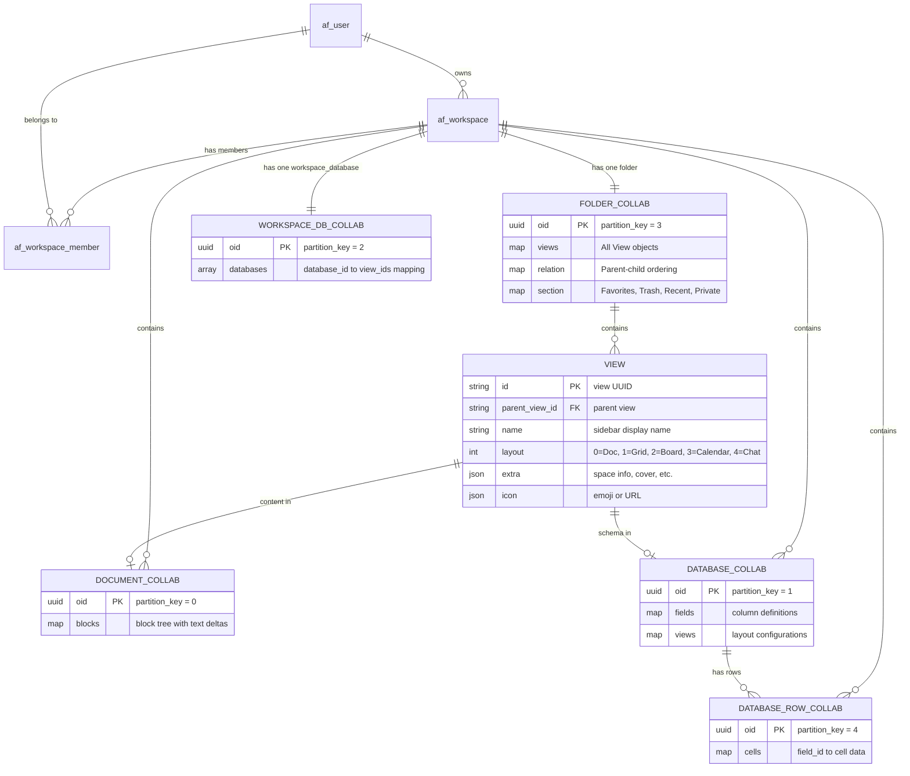

# Workspace Data Model Design

> How pages, folders, databases, and all workspace content map from the database to application logic.

---

## Table of Contents

- [Architecture Overview](#architecture-overview)
- [PostgreSQL Schema: The Relational Layer](#postgresql-schema-the-relational-layer)
- [CRDT Layer: The Collaborative Data Model](#crdt-layer-the-collaborative-data-model)
- [The Folder Collab — Page Tree Index](#the-folder-collab--page-tree-index)
- [View Struct — The Page Entity](#view-struct--the-page-entity)
- [ViewLayout — Page Types](#viewlayout--page-types)
- [Sections — Favorites, Trash, Recent, Private](#sections--favorites-trash-recent-private)
- [Document Collab — Page Content](#document-collab--page-content)
- [Database Collabs — Grid, Board, Calendar](#database-collabs--grid-board-calendar)
- [Multi-Tier Storage Architecture](#multi-tier-storage-architecture)
- [Entity Relationship Diagram](#entity-relationship-diagram)
- [Data Flow: Creating a Page](#data-flow-creating-a-page)
- [Data Flow: Opening a Page](#data-flow-opening-a-page)
- [SQL Reference Queries](#sql-reference-queries)

---

## Architecture Overview

AppFlowy Cloud uses a **hybrid storage model**: relational PostgreSQL tables provide workspace-level structure and access control, while all actual content (page text, database schemas, folder trees) is stored as **Yrs CRDT binary blobs** inside the `af_collab` table.

```
┌─────────────────────────────────────────────────────────┐
│                    PostgreSQL                           │
│                                                         │
│  af_user  ──1:N──▶  af_workspace  ──1:N──▶  af_collab  │
│                         │                      │        │
│                    af_workspace_member     (CRDT blobs)  │
│                         │                      │        │
│                    af_collab_member        af_collab_    │
│                                           snapshot      │
│                                           embeddings    │
└─────────────────────────────────────────────────────────┘
              ▲                          ▲
              │                          │
       Relational metadata        CRDT binary data
       (users, roles, ACLs)       (content, hierarchy)
```

The critical insight is that **page names, page hierarchy, and page ordering are NOT in relational columns** — they are encoded inside the Folder collab's CRDT document. The relational layer only knows object IDs, types, and ownership.

---

## PostgreSQL Schema: The Relational Layer

### `af_workspace` — Workspace registry

```sql
CREATE TABLE af_workspace (
    workspace_id   UUID PRIMARY KEY DEFAULT uuid_generate_v4(),
    owner_uid      BIGINT NOT NULL REFERENCES af_user(uid),
    workspace_name TEXT DEFAULT 'My Workspace',
    workspace_type INTEGER NOT NULL DEFAULT 0,  -- 0 = Free
    created_at     TIMESTAMPTZ DEFAULT CURRENT_TIMESTAMP,
    deleted_at     TIMESTAMPTZ DEFAULT NULL
);
```

Each user gets one workspace on signup. The workspace is the top-level container for all content.

### `af_workspace_member` — Membership & roles

```sql
CREATE TABLE af_workspace_member (
    uid          BIGINT NOT NULL,
    role_id      INT NOT NULL REFERENCES af_roles(id),
    workspace_id UUID NOT NULL REFERENCES af_workspace(workspace_id),
    PRIMARY KEY (uid, workspace_id)
);
```

Roles are: `Owner (1)`, `Member (2)`, `Guest (3)`.

### `af_collab` — The universal content table

```sql
CREATE TABLE af_collab (
    oid            UUID PRIMARY KEY,
    workspace_id   UUID NOT NULL REFERENCES af_workspace(workspace_id),
    owner_uid      BIGINT NOT NULL,
    partition_key  INTEGER NOT NULL,   -- CollabType discriminator
    blob           BYTEA NOT NULL,     -- Yrs CRDT encoded state
    len            INTEGER,
    created_at     TIMESTAMPTZ DEFAULT CURRENT_TIMESTAMP,
    updated_at     TIMESTAMPTZ DEFAULT CURRENT_TIMESTAMP,
    deleted_at     TIMESTAMPTZ DEFAULT NULL,
    indexed_at     TIMESTAMPTZ         -- last embedding generation time
);
```

> **Note**: The table was originally partitioned by `partition_key` into separate physical tables (`af_collab_document`, `af_collab_folder`, etc.) but was de-partitioned in migration `20250318120849` into a single unified table. The `partition_key` column remains as a logical discriminator.

### `partition_key` — The `CollabType` enum

Every row in `af_collab` is tagged with a `partition_key` that maps to a Rust enum:

| `partition_key` | `CollabType` | Description | Typical count per workspace |
|---|---|---|---|
| **0** | `Document` | Rich-text page content | One per page |
| **1** | `Database` | Grid/Board/Calendar schema & data | One per database |
| **2** | `WorkspaceDatabase` | Index of all databases in workspace | Exactly one |
| **3** | `Folder` | The page tree / sidebar hierarchy | **Exactly one** |
| **4** | `DatabaseRow` | A single row in a database | One per row |
| **5** | `UserAwareness` | User-specific state (e.g., sidebar) | One per user |

### `af_collab_snapshot` — Point-in-time snapshots

```sql
CREATE TABLE af_collab_snapshot (
    sid          BIGSERIAL PRIMARY KEY,
    oid          TEXT NOT NULL,
    blob         BYTEA NOT NULL,
    len          INTEGER NOT NULL,
    workspace_id UUID NOT NULL REFERENCES af_workspace(workspace_id),
    created_at   TIMESTAMPTZ DEFAULT CURRENT_TIMESTAMP
);
```

Periodic snapshots of collab state for recovery. Created by the `CollabGroup` snapshot task at configurable intervals.

### `af_collab_embeddings` — Vector search index

Stores chunked text fragments with vector embeddings for semantic search. Each document collab can have multiple embedding fragments:

```sql
-- Key columns (simplified)
fragment_id UUID, oid UUID, content TEXT, embedding vector,
content_type INT, fragment_index INT, indexed_at TIMESTAMPTZ
```

---

## CRDT Layer: The Collaborative Data Model

All content in `af_collab.blob` is a **Yrs** (Rust port of Yjs) CRDT document. The blob is opaque binary — it cannot be queried with SQL. It must be deserialized through the `collab-*` Rust crates:

| Crate | Deserializes `partition_key` | Root CRDT key |
|---|---|---|
| `collab-folder` | `3` (Folder) | `"folder"` → `"meta"`, `"views"`, `"relation"`, `"section"` |
| `collab-document` | `0` (Document) | `"document"` |
| `collab-database` | `1` (Database) | `"database"` → `"id"`, `"metas"` |
| `collab-entity` | `2` (WorkspaceDatabase) | `"databases"` |
| `collab-entity` | `4` (DatabaseRow) | `"data"` → `"id"` |
| `collab-entity` | `5` (UserAwareness) | `"user_awareness"` |

---

## The Folder Collab — Page Tree Index

The single most important collab for understanding workspace structure is the **Folder** (`partition_key = 3`). There is exactly **one Folder collab per workspace**, and it contains:

### `FolderData` — Top-level structure

```rust
pub struct FolderData {
    pub uid: i64,                      // Owner user ID
    pub workspace: Workspace,          // Workspace metadata
    pub current_view: String,          // Currently open view ID
    pub views: Vec<View>,              // All views (pages) in the workspace
    pub favorites: SectionsByUid,      // Favorited views, per user
    pub recent: SectionsByUid,         // Recently accessed views, per user
    pub trash: SectionsByUid,          // Trashed views, per user
    pub private: SectionsByUid,        // Private views, per user
}
```

### `Workspace` — Workspace node inside the Folder

```rust
pub struct Workspace {
    pub id: String,                             // == workspace_id from af_workspace
    pub name: String,
    pub child_views: RepeatedViewIdentifier,     // Top-level page IDs (sidebar roots)
    pub created_at: i64,
    pub created_by: Option<i64>,
    pub last_edited_time: i64,
    pub last_edited_by: Option<i64>,
}
```

The `child_views` field is the **ordered list of top-level pages** visible in the sidebar. Sub-pages are stored recursively via each `View`'s own `children` field.

### CRDT Map structure inside the Folder blob

```
folder (Map)
├── meta (Map)
│   └── current_workspace: "<workspace-uuid>"
├── views (Map)                          ← keyed by view_id
│   ├── "<view-uuid-1>" (Map)
│   │   ├── id: "<view-uuid-1>"
│   │   ├── name: "My First Page"
│   │   ├── bid: "<parent-view-uuid>"    ← parent view ID
│   │   ├── layout: 0                   ← ViewLayout enum
│   │   ├── created_at: 1709932800
│   │   ├── created_by: 12345
│   │   ├── last_edited_time: 1709936400
│   │   ├── last_edited_by: 12345
│   │   ├── icon: '{"ty":0,"value":"📄"}'
│   │   ├── extra: '{"is_space":true,...}'
│   │   └── is_locked: false
│   ├── "<view-uuid-2>" (Map) ...
│   └── "<view-uuid-N>" (Map) ...
├── relation (Map)                       ← parent → children ordering
│   ├── "<workspace-uuid>" (Array)       ← workspace's top-level children
│   │   ├── { id: "<view-uuid-1>" }
│   │   └── { id: "<view-uuid-2>" }
│   ├── "<view-uuid-1>" (Array)          ← page 1's sub-pages
│   │   └── { id: "<view-uuid-3>" }
│   └── ...
└── section (Map)                        ← per-user metadata
    ├── favorite (Map)
    │   └── "<uid>" (Array) [{ id, timestamp }, ...]
    ├── recent (Map)
    │   └── "<uid>" (Array) [{ id, timestamp }, ...]
    ├── trash (Map)
    │   └── "<uid>" (Array) [{ id, timestamp }, ...]
    └── private (Map)
        └── "<uid>" (Array) [{ id, timestamp }, ...]
```

---

## View Struct — The Page Entity

Every page, space, database view, and chat in the sidebar is represented as a `View`:

```rust
pub struct View {
    pub id: String,                     // The view's UUID
    pub parent_view_id: String,         // Parent view (or workspace_id for top-level)
    pub name: String,                   // Display name in sidebar
    pub children: RepeatedViewIdentifier, // Ordered child view IDs
    pub created_at: i64,                // Unix timestamp
    pub is_favorite: bool,              // Whether user has favorited this
    pub layout: ViewLayout,             // Document, Grid, Board, Calendar, Chat
    pub icon: Option<ViewIcon>,         // Emoji, URL, or icon reference
    pub created_by: Option<i64>,        // User ID who created
    pub last_edited_time: i64,
    pub last_edited_by: Option<i64>,
    pub is_locked: Option<bool>,        // Page lock state
    pub extra: Option<String>,          // JSON blob for space info, cover, etc.
}
```

### Space detection

A `View` is a **Space** (the top-level organizational container in the sidebar) when its `extra` JSON field contains `is_space: true`:

```json
{
  "is_space": true,
  "space_icon": "📁",
  "space_icon_color": "#a2e1c3",
  "space_permission": 0
}
```

Spaces are just Views with special metadata — there's no separate "Space" table.

### View identity mapping

Each View's `id` directly corresponds to an `af_collab.oid`:

- **Document page**: `view.id` → `af_collab` row with `partition_key = 0` (Document)
- **Grid/Board/Calendar page**: `view.id` → `af_collab` row with `partition_key = 0` (Document for the view), plus a linked `partition_key = 1` (Database) for the database schema
- **Chat page**: `view.id` → chat session (stored in `af_chat` table, not `af_collab`)

---

## ViewLayout — Page Types

```rust
pub enum ViewLayout {
    Document  = 0,  // Rich-text document (the default page type)
    Grid      = 1,  // Spreadsheet-like table
    Board     = 2,  // Kanban board
    Calendar  = 3,  // Calendar view
    Chat      = 4,  // AI chat
}
```

Grid, Board, and Calendar are all **database views** — different visual presentations of the same underlying `Database` collab.

---

## Sections — Favorites, Trash, Recent, Private

Sections are per-user lists of view IDs stored within the Folder collab:

```rust
pub enum Section {
    Favorite,    // User's pinned pages
    Recent,      // Recently accessed pages (auto-updated)
    Trash,       // Soft-deleted pages (recoverable)
    Private,     // Private pages only visible to the user
}
```

Each section is a `Map<UserId, Array<SectionItem>>` inside the Folder CRDT:

```rust
pub struct SectionItem {
    pub id: String,        // view_id
    pub timestamp: i64,    // when it was added to this section
}
```

This means **favorites, trash, and recents are per-user** — different users in a shared workspace see different favorites and recent lists.

---

## Document Collab — Page Content

A Document collab (`partition_key = 0`) stores the rich-text content of a page. Its CRDT structure has a root key `"document"` containing the block tree:

```
document (Map)
├── blocks (Map)
│   ├── "<block-id>" (Map)
│   │   ├── id: "<block-id>"
│   │   ├── ty: "paragraph" | "heading" | "todo_list" | ...
│   │   ├── parent: "<parent-block-id>"
│   │   ├── children: "<children-map-id>"
│   │   └── data: { "delta": [...] }   ← Yjs text delta
│   └── ...
├── meta (Map)
│   └── children_map (Map)
│       └── "<children-map-id>" (Array)
│           └── ["<child-block-id-1>", "<child-block-id-2>"]
└── page_id: "<root-block-id>"
```

The text content within each block uses **Yjs text deltas** — a list of insert/retain/delete operations that support rich formatting (bold, italic, links, mentions, etc.).

---

## Database Collabs — Grid, Board, Calendar

When a user creates a Grid/Board/Calendar, multiple collabs are created:

### 1. Database collab (`partition_key = 1`)

Contains the schema (fields/columns), views, and layout settings:

```
database (Map)
├── id: "<database-uuid>"
├── metas (Map)
│   └── iid: "<inline-view-id>"     ← the primary view
├── fields (Map)
│   └── "<field-id>" (Map)
│       ├── id, name, field_type, ...
│       └── type_option (Map)
├── views (Map)
│   └── "<view-id>" (Map)
│       ├── layout: 1 (Grid) | 2 (Board) | 3 (Calendar)
│       ├── filters, sorts, group_settings, ...
│       └── field_settings (Map)
└── rows (ordering info)
```

### 2. Database Row collabs (`partition_key = 4`)

Each row in the database is its own collab (enabling fine-grained collaboration):

```
data (Map)
├── id: "<row-uuid>"
└── cells (Map)
    ├── "<field-id>" (Map) → cell data
    └── ...
```

### 3. WorkspaceDatabase collab (`partition_key = 2`)

A workspace-level index that maps database IDs to their views. There is **one per workspace**:

```
databases (Array)
├── { id: "<database-uuid>", views: ["<view-id-1>", "<view-id-2>"] }
└── ...
```

### Full picture for a new Grid page:

```
User clicks "New Grid"
  │
  ├─▶ Folder collab updated: new View { id: V, layout: Grid, parent: P }
  │
  ├─▶ af_collab INSERT: oid=V, partition_key=0 (Document, minimal/empty)
  │
  ├─▶ af_collab INSERT: oid=D, partition_key=1 (Database schema)
  │
  ├─▶ af_collab INSERT: oid=R1, partition_key=4 (Row 1)
  ├─▶ af_collab INSERT: oid=R2, partition_key=4 (Row 2)
  ├─▶ af_collab INSERT: oid=R3, partition_key=4 (Row 3)
  │
  └─▶ WorkspaceDatabase collab updated: { id: D, views: [V] }
```

---

## Multi-Tier Storage Architecture

Collab blobs are stored across multiple tiers for performance:

```
┌──────────────┐    ┌──────────────┐    ┌──────────────┐    ┌──────────────┐
│   In-Memory  │    │    Redis     │    │   S3/MinIO   │    │  PostgreSQL  │
│   (Collab    │───▶│   (Cache)    │───▶│  (Large      │───▶│  (af_collab) │
│    Group)    │    │              │    │   blobs)     │    │              │
└──────────────┘    └──────────────┘    └──────────────┘    └──────────────┘
  Active editing      Recent access      blob > 8KB          All blobs
```

- **In-Memory**: Active `CollabGroup` holds the live CRDT state while users are editing
- **Redis**: Cache layer for recently accessed collabs
- **S3/MinIO**: Blobs larger than `APPFLOWY_COLLAB_S3_THRESHOLD` (default: 8000 bytes) are stored in S3 with a null `blob` in PostgreSQL
- **PostgreSQL**: Stores the blob directly in `af_collab.blob` for small documents; stores only metadata (with `blob = NULL`) for S3-offloaded documents

---

## Entity Relationship Diagram



---

## Data Flow: Creating a Page

When `create_page()` (in `src/biz/workspace/page_view.rs`) is called:

```
1. Generate new view_id (UUID)

2. Update the Folder collab (partition_key = 3):
   ├── Insert new View into the "views" map
   ├── Add view_id to parent's children in "relation" map
   └── Encode the CRDT update → publish to Redis Stream

3. Create the content collab:
   ├── For Document (layout = 0):
   │   └── INSERT af_collab: oid = view_id, partition_key = 0
   │       blob = empty document CRDT state
   │
   ├── For Grid/Board/Calendar (layout = 1/2/3):
   │   ├── Generate database_id (UUID)
   │   ├── INSERT af_collab: oid = database_id, partition_key = 1
   │   │   blob = database schema with default fields
   │   ├── INSERT af_collab: oid = row_1_id, partition_key = 4
   │   ├── INSERT af_collab: oid = row_2_id, partition_key = 4
   │   ├── INSERT af_collab: oid = row_3_id, partition_key = 4
   │   └── Update WorkspaceDatabase collab (partition_key = 2):
   │       add { id: database_id, views: [view_id] }
   │
   └── For Chat (layout = 4):
       └── INSERT af_chat row (separate table)

4. Return Page { view_id, collab_type, ... }
```

---

## Data Flow: Opening a Page

When a client opens a page (via WebSocket or REST):

```
1. Client sends sync request with view_id

2. Server resolves content:
   ├── Check CollabCache (in-memory → Redis → S3 → PostgreSQL)
   ├── Deserialize the CRDT blob using appropriate crate:
   │   ├── partition_key = 0 → collab-document
   │   ├── partition_key = 1 → collab-database
   │   └── partition_key = 3 → collab-folder
   └── Return EncodedCollab to client

3. For realtime editing (WebSocket):
   ├── CollabGroup is created/found for this view_id
   ├── StreamRouter starts XREAD on Redis Stream for this workspace
   ├── Client subscribes to the CollabGroup's broadcast
   └── CRDT updates flow bidirectionally:
       Client ──ws──▶ Server ──XADD──▶ Redis Stream
                                            │
       Client ◀──ws── Server ◀──XREAD──────┘
```

---

## SQL Reference Queries

### List all content in a workspace by type

```sql
SELECT
  partition_key,
  CASE partition_key
    WHEN 0 THEN 'Document'
    WHEN 1 THEN 'Database'
    WHEN 2 THEN 'WorkspaceDatabase'
    WHEN 3 THEN 'Folder'
    WHEN 4 THEN 'DatabaseRow'
    WHEN 5 THEN 'UserAwareness'
  END AS content_type,
  COUNT(*) AS count,
  pg_size_pretty(SUM(length(blob))::bigint) AS total_size
FROM af_collab
WHERE workspace_id = '<your-workspace-id>'
  AND deleted_at IS NULL
GROUP BY partition_key
ORDER BY partition_key;
```

### Find the Folder collab for a workspace

```sql
SELECT oid, length(blob) AS size_bytes, updated_at
FROM af_collab
WHERE workspace_id = '<your-workspace-id>'
  AND partition_key = 3;
```

### List all documents (pages) in a workspace

```sql
SELECT oid AS view_id, length(blob) AS size_bytes,
       created_at, updated_at
FROM af_collab
WHERE workspace_id = '<your-workspace-id>'
  AND partition_key = 0
  AND deleted_at IS NULL
ORDER BY updated_at DESC;
```

### Find all database rows for a given database

```sql
-- First find the database's collab
SELECT oid AS database_id
FROM af_collab
WHERE workspace_id = '<your-workspace-id>'
  AND partition_key = 1;

-- Then find its rows (requires knowing which row oids belong to which database,
-- which is encoded in the database collab's CRDT — not queryable from SQL directly)
SELECT oid AS row_id, length(blob) AS size_bytes
FROM af_collab
WHERE workspace_id = '<your-workspace-id>'
  AND partition_key = 4
  AND deleted_at IS NULL;
```

### Count workspace members

```sql
SELECT wm.uid, u.email, r.name AS role
FROM af_workspace_member wm
JOIN af_user u ON wm.uid = u.uid
JOIN af_roles r ON wm.role_id = r.id
WHERE wm.workspace_id = '<your-workspace-id>';
```

---

## Key Design Decisions

| Decision | Rationale |
|---|---|
| **Single `af_collab` table for all content** | Simplifies the storage API — all collabs are CRDT blobs regardless of content type. The `partition_key` discriminator avoids schema sprawl. |
| **Page hierarchy in CRDT, not SQL** | The folder tree (parent-child relationships, ordering, naming) must support conflict-free real-time editing across clients. Storing it as a CRDT enables offline edits and automatic merge. |
| **Each database row = separate collab** | Enables fine-grained collaboration: two users editing different rows don't conflict. Avoids loading the entire database into memory. |
| **Spaces are just Views with `extra` JSON** | No separate entity — a View with `is_space: true` in its `extra` field is a Space. This keeps the model flat and extensible. |
| **Sections (favorites, trash) are per-user** | Stored as `Map<UserId, Array<SectionItem>>` in the Folder CRDT. Each user has their own favorites/recent/trash list, resolved at read time based on `uid`. |
| **S3 offloading for large blobs** | Blobs > 8 KB are stored in S3/MinIO instead of PostgreSQL, keeping the database lean. The threshold is configurable via `APPFLOWY_COLLAB_S3_THRESHOLD`. |
